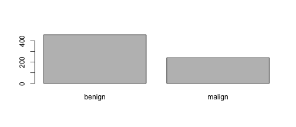

## Introduction

"Worldwide, breast cancer is the most common invasive cancer in women. Breast cancer comprises 22.9% of invasive cancers in women and 16% of all female cancers. In 2012, it comprised 25.2% of cancers diagnosed in women, making it the most common female cancer. [...] Breast cancer screening refers to testing otherwise-healthy women for breast cancer in an attempt to achieve an earlier diagnosis under the assumption that early detection will improve outcomes." [1].

The Breast Cancer Wisconsin (Diagnostic) Data Set provides data on benign and malign breast cancer. These data are publicly available at the Machine Learning Repository. This dataset comprises 458 (65.5%) benign istances and 241 (34.5%) malignant istances [2].

REF:

[1]: Wikipedia [http://en.wikipedia.org/wiki/Breast_cancer]

[2]: Lichman, M. (2013). UCI Machine Learning Repository [http://archive.ics.uci.edu/ml]. Irvine, CA: University of California, School of Information and Computer Science.


--- .class #id

## Why a Shiny App?

Before starting to apply statistical and/or machine learnig frameworks to build a classifier, an important step is to get a feeling about the data.

The better feeling we have with the data, the better classifier we will be able to develop.

The proposed Shiny app is a simple visualization platform of these data, which allows the user to choose two variables at the time and :

1. Plot them against each other
2. See the basic summary of each of the two variables
3. Find out how well the second variable predicts the first one (using a simple linear model)

--- .class #id

## What the data looks like?

Here we load, compute, and print the the summaries of the Class variable and we plot the correspondent histogram:


```r
data <- read.csv("breast-cancer-wisconsin.csv")
summary(data$Class)
```

```
## benign malign 
##    458    241
```

```r
plot(data$Class)
```

 

--- .class #id

## Conclusion

Thanks for your attention!

Please try out the Shiny app

at this URL

[http://en.wikipedia.org/]

